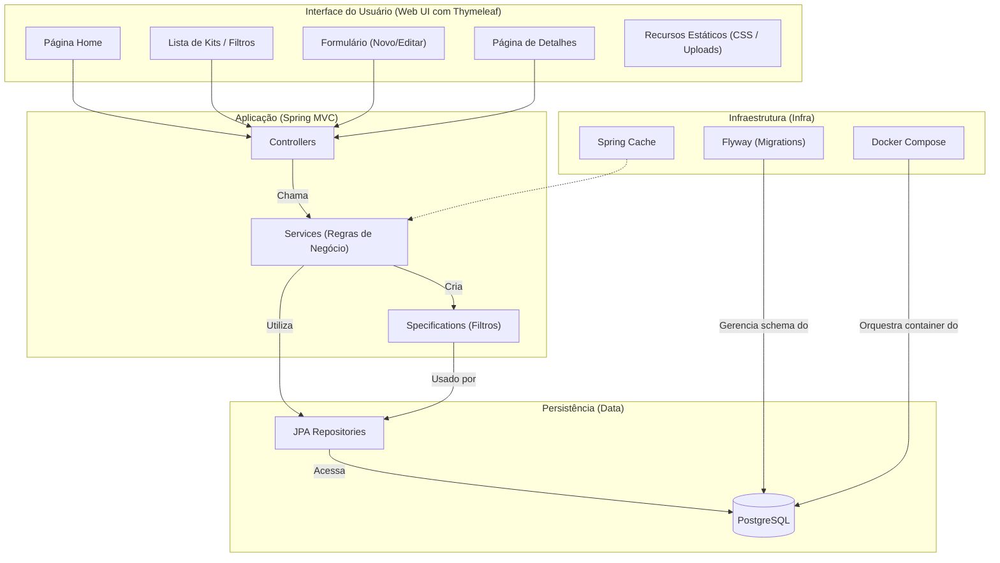

# Gundam Collection Administrator

  

---

Gestor completo de coleção de Gunpla (Gundam), com cadastro de kits, fotos, filtros, catálogos fixos e relatórios simples. UI com tema inspirado no RX-78-2, i18n (PT/EN/JA) e uploads estáticos.

---

## Índice

- [Gundam Collection Administrator](#gundam-collection-administrator)
  - [Índice](#índice)
  - [Dados do Projeto](#dados-do-projeto)
  - [Arquitetura](#arquitetura)
  - [Estrutura do Projeto](#estrutura-do-projeto)
  - [Programação (Java Spring)](#programação-java-spring)
  - [Funcionamento da Parte Web](#funcionamento-da-parte-web)
  - [Funcionalidades](#funcionalidades)
  - [Modelagem de Domínio](#modelagem-de-domínio)
  - [Requisitos e Setup](#requisitos-e-setup)
  - [Execução](#execução)
  - [Rotas Principais](#rotas-principais)
  - [Camadas e Pacotes](#camadas-e-pacotes)
  - [Migrações de Banco](#migrações-de-banco)
  - [Configurações](#configurações)
  - [Troubleshooting](#troubleshooting)
  - [Roadmap](#roadmap)

---

## Dados do Projeto

- Nome: Gundam Collection Administrator
- Stack: Spring Boot 3.5, Java 17, Thymeleaf, Spring Data JPA, Flyway, PostgreSQL, Gradle
- Porta padrão: `8080`
- Banco de dados (dev): `postgres:latest` via Docker Compose, porta `5432` (db/name/user/pass `gundam`)
- Diretório de uploads: `uploads/` (servido em `/uploads/**`)
- Internacionalização (i18n): mensagens em `messages.properties` (pt-BR), `messages_en.properties`, `messages_ja.properties` com alternância via parâmetro `?lang=`

---

## Arquitetura

---

## Estrutura do Projeto

- `src/main/java/br/com/gundam`
  - `GundamApplication.java` — bootstrap da aplicação
  - `config/` — `WebConfig` (recursos estáticos, i18n, locale), `CacheConfig`
  - `controller/` — `HomeController`, `GundamKitController`
  - `service/` — `GundamKitService`, `FileStorageService`
  - `repository/` — repositórios JPA (inclui queries de relatório)
  - `spec/` — Specifications para filtros dinâmicos
  - `model/` — entidades JPA (GundamKit, Grade, Escala, AlturaPadrao, Universo)
- `src/main/resources`
  - `templates/` — views Thymeleaf (`layout.html`, `home.html`, `kits/*`, `sobre.html`, `relatorios.html`)
  - `static/css/` — estilos (`global.css`)
  - `db/migration/` — migrações Flyway `V1..V5`
  - `application.yml` — configuração da aplicação
- `compose.yaml` — serviço `postgres`
- `build.gradle` — dependências e plugins

---

*(restante do README continua igual, sem alterações)*
