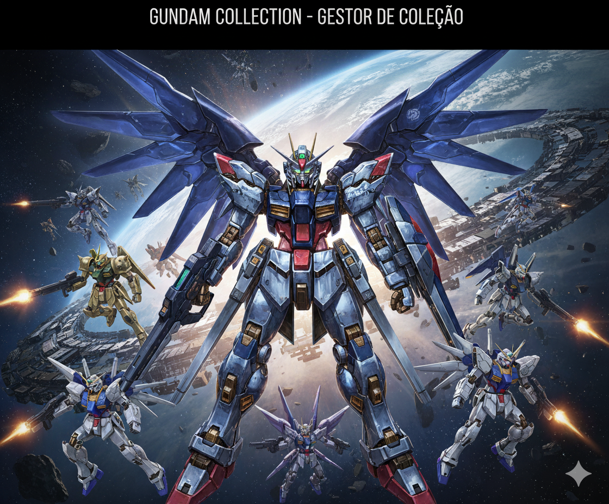

# Gundam Collection Administrator

<div align="center">
  
</div>

[](https://adoptium.net)
[](https://spring.io/projects/spring-boot)
[](https://www.thymeleaf.org/)
[](https://www.postgresql.org/)
[](https://flywaydb.org/)
[](https://gradle.org/)
[](https://docs.docker.com/compose/)

Gestor completo de coleção de Gunpla (Gundam), com cadastro de kits, fotos, filtros, catálogos fixos e relatórios simples. UI com tema inspirado no **RX‑78‑2**, i18n (PT/EN/JA) e uploads estáticos.

---

## Índice

- [Dados do Projeto](#dados-do-projeto)
- [Arquitetura](#arquitetura)
- [Estrutura do Projeto](#estrutura-do-projeto)
- [Programação (Java Spring)](#programação-java-spring)
- [Funcionamento da Parte Web](#funcionamento-da-parte-web)
- [Funcionalidades](#funcionalidades)
- [Modelagem de Domínio](#modelagem-de-domínio)
- [Requisitos e Setup](#requisitos-e-setup)
- [Execução](#execução)
- [Rotas Principais](#rotas-principais)
- [Camadas e Pacotes](#camadas-e-pacotes)
- [Migrações de Banco](#migrações-de-banco)
- [Configurações](#configurações)
- [Troubleshooting](#troubleshooting)
- [Roadmap](#roadmap)
- [Licença](#licença)

---

## Dados do Projeto

- **Nome:** *Gundam Collection Administrator*
- **Stack:** Spring Boot 3.5, Java 17, Thymeleaf, Spring Data JPA, Flyway, PostgreSQL, Gradle
- **Porta padrão:** `8080`
- **Banco de dados (dev):** `postgres:latest` via Docker Compose, porta `5432` (db/name/user/pass `gundam`)
- **Diretório de uploads:** `uploads/` (servido em `/uploads/**`)
- **Internacionalização (i18n):** mensagens em `messages.properties` (pt-BR), `messages_en.properties`, `messages_ja.properties` com alternância via parâmetro `?lang=`

---

## Arquitetura

> Diagrama em **Mermaid** válido (corrigido para não quebrar renderização).

```mermaid
flowchart TB
  %% Camada Web
  subgraph Web[Web UI (Thymeleaf)]
    UI1[Home]
    UI2[Kits List/Filters]
    UI3[Form Novo/Editar]
    UI4[Detalhes]
    UI5[Recursos Estáticos (CSS / Uploads)]
  end

  %% Camada MVC
  subgraph MVC[Spring MVC]
    C1[Controllers]
    S1[Services]
    V1[Specifications]
  end

  %% Camada de Dados
  subgraph Data[Data Layer]
    R1[JPA Repositories]
    DB[(PostgreSQL)]
  end

  %% Fluxos
  UI1 --> C1
  UI2 --> C1
  UI3 --> C1
  UI4 --> C1
  C1 --> S1 --> R1 --> DB
  S1 --> V1

  %% Infra
  subgraph Infra[Infra]
    F1[Flyway]
    Cache[Spring Cache]
    Dk[Docker Compose]
  end

  F1 --> DB
  Cache --> S1
  Dk --> DB
```

---

## Estrutura do Projeto

```
src/
├─ main/
│  ├─ java/br/com/gundam/
│  │  ├─ GundamApplication.java           # bootstrap
│  │  ├─ config/                          # WebConfig, CacheConfig
│  │  ├─ controller/                      # HomeController, GundamKitController
│  │  ├─ service/                         # GundamKitService, FileStorageService
│  │  ├─ repository/                      # Spring Data JPA repositories
│  │  ├─ spec/                            # Specifications para filtros dinâmicos
│  │  └─ model/                           # Entidades JPA (GundamKit, Grade, Escala, AlturaPadrao, Universo)
│  └─ resources/
│     ├─ templates/                       # Thymeleaf (layout, home, kits/*, sobre, relatorios)
│     ├─ static/css/                      # global.css
│     ├─ db/migration/                    # V1..V5 (Flyway)
│     └─ application.yml                  # configuração
├─ test/                                  # testes (quando aplicável)
compose.yaml                               # serviço postgres
build.gradle(.kts)                         # build e dependências
README.md
```

---

## Programação (Java Spring)

- **Controllers (Spring MVC):** tratam rotas, populam `Model` e retornam templates.
  - `GundamKitController` cobre CRUD e filtros com paginação.
  - `HomeController` entrega páginas estáticas e relatório financeiro.
- **Services:** regras de negócio e cache.
  - `GundamKitService` utiliza `@Cacheable`/`@CacheEvict` para catálogos e itens; monta `Specification`; agrega dados para relatório.
  - `FileStorageService` padroniza salvamento de imagens e nomes de arquivos sob `app.storage.root`.
- **Repositories:** `JpaRepository` + `JpaSpecificationExecutor` e queries JPQL para `SUM / AVG / MIN / MAX`.
- **Specifications:** composição dinâmica (`modelo like`, `gradeId`, `universoId`, `dataCompra between`).  
- **Config:** `CacheConfig` (ConcurrentMapCacheManager), `WebConfig` (static `/uploads/**`, i18n via cookie + `?lang=`).
- **Validações:** Bean Validation (ex.: `@NotBlank`, `@DecimalMin`, `@Digits`).  
- **Migrações:** Flyway habilitado; `ddl-auto: validate` garante schema 100% via SQL versionado.

---

## Funcionamento da Parte Web

- **Templates Thymeleaf:** layout base `layout.html` (head/header/footer). Páginas herdam via `th:replace`.
- **Navegação:** Home (`/`), Gerenciador (`/kits`), Relatórios (`/relatorios`), Sobre (`/sobre`). Destaque do link ativo pelo `requestURI`.
- **Listagem com filtros:** formulário `GET /kits` envia `modelo`, `gradeId`, `universoId`, `de`, `ate`, mais `page`/`size`. Tabela com paginação.
- **Formulário de Kit:** create/update no mesmo template, selects de catálogos, upload de imagens (caixa/montagem). Bean Validation exibindo mensagens i18n.
- **Uploads:** imagens em `uploads/` (persistidas no campo URL da entidade) e servidas por `/uploads/**`.
- **I18n:** textos em `messages*.properties`. Troca com `?lang=pt-BR|en|ja` (persistência via cookie).
- **Estática:** tema RX‑78‑2 em `static/css/global.css` e imagem `static/images/gundam.png`.

---

## Funcionalidades

- CRUD de Kits (modelo, fabricante, preço, data, horas, URLs e fotos de capa/caixa/montagem)
- Catálogos fixos: **Grades**, **Escalas**, **Alturas Padrão**
- Universo/Linha do tempo (UC, CE, AC, …) e **Observações** longas
- **Filtros**: modelo (like), grade, universo, período de compra, paginação
- **Uploads** de imagens com exposição via `/uploads/**`
- Páginas: Home, Listagem, Formulário (novo/editar), Detalhes, Sobre, Relatórios (placeholder)
- **Flyway** com *seed* inicial e **Cache** simples para listas

---

## Modelagem de Domínio

**Entidades principais:**

- `GundamKit` (kit da coleção)  
  Relaciona-se com `Grade`, `Escala`, `AlturaPadrao`, `Universo`.  
  Campos: `modelo`, `fabricante`, `preco`, `dataCompra`, `horasMontagem`, URLs/fotos, `observacao`.
- `Grade` (MG, HG, RG, …)
- `Escala` (1/144, 1/100…)
- `AlturaPadrao` (faixas de altura)
- `Universo` (UC, CE, AC… com `sigla`, `principaisSeries`, `descricao`)

Validações (Bean Validation) em `GundamKit` garantem integridade (ex.: `@NotBlank`, `@Digits`, `@DecimalMin`).

---

## Requisitos e Setup

- **Java 17+**
- **Gradle Wrapper** (já incluso)
- **Docker + Docker Compose** (para PostgreSQL)

**Subir banco (Docker Compose):**
```bash
docker compose up -d
```

**Config da aplicação (`src/main/resources/application.yml`):**
- Datasource: `jdbc:postgresql://localhost:5432/gundam` (user/pass `gundam`)
- Flyway: habilitado e apontando para `classpath:db/migration`
- Spring MVC: locale resolver via cookie; mapeamento `/uploads/**`

---

## Execução

**Via Gradle (recomendado):**
```bash
# Windows
.\gradlew.bat clean build -x test
.\gradlew.bat bootRun
```

A primeira execução cria o schema e aplica `V1..V5`.

> **Erros de checksum do Flyway?**  
> Rode uma vez:
```bash
.\gradlew.bat bootRun --args="--flyway.repair=true"
```

> **IDE usando `bin/` no classpath e conflitando com `build/`?**  
> Apague `bin/` e configure a IDE para usar o Gradle como *builder/classpath*.

---

## Rotas Principais

- **Home:** `GET /`
- **Kits:**
  - Listagem: `GET /kits?modelo=&gradeId=&universoId=&de=&ate=&page=&size=`
  - Novo: `GET /kits/novo`
  - Salvar: `POST /kits` *(multipart para fotos)*
  - Detalhes: `GET /kits/{id}`
  - Editar: `GET /kits/{id}/editar`
  - Atualizar: `POST /kits/{id}`
  - Excluir: `POST /kits/{id}/deletar`
- **Utilitários:** `/sobre`, `/relatorios`

---

## Camadas e Pacotes

- `br.com.gundam.controller` – MVC controllers (Kits, Home)  
- `br.com.gundam.service` – regras de negócio, cache  
- `br.com.gundam.repository` – repositórios JPA  
- `br.com.gundam.model` – entidades JPA  
- `br.com.gundam.spec` – Specifications (filtros)  
- `br.com.gundam.config` – Cache e Web config (uploads estáticos)  
- `resources/templates` – Thymeleaf (layout + páginas)  
- `resources/static/css` – estilos (tema RX‑78‑2)  

---

## Migrações de Banco

- `V1__create_tables.sql` – tabelas base (`grade`, `escala`, `altura_padrao`, `gundam_kits`)
- `V2__seed_reference_data.sql` – *seeds* de catálogos
- `V4__universo_and_observacao.sql` – tabela `universo`, colunas `universo_id` e `observacao` em `gundam_kits`
- `V5__seed_universos.sql` – *seeds* dos universos (UC, CE, AC… AS)

> **Boa prática:** não edite migrações já aplicadas. Crie novas `Vx__...sql` para mudanças.

---

## Configurações

- **Cache:** `ConcurrentMapCacheManager`  
  Caches: `grades_all`, `escalas_all`, `alturas_all`, `universos_all`, `kit_by_id`
- **Uploads:**  
  `FileStorageService` salva em `app.storage.root` (padrão `uploads/`)  
  Servido em `/uploads/**` via `WebConfig`

---

## Troubleshooting

- **Flyway checksum:** use `--flyway.repair=true` ou recrie o schema local.  
- **Artefatos antigos (`bin/`):** apague `bin/` e force a IDE a usar Gradle.  
- **LazyInitialization em views:** utilize `EAGER` quando necessário em `GundamKit` para relacionamentos mostrados no template.

---

## Roadmap

- Máscara de moeda e mensagens de erro amigáveis no formulário
- Catálogo/CRUD visual de Universos
- Exportar lista (CSV/Excel)
- Ordenação multi-coluna e favoritos

---

## Licença

Este projeto é distribuído sob a licença MIT. Veja `LICENSE` (se disponível).
